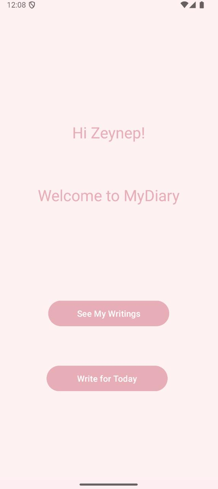
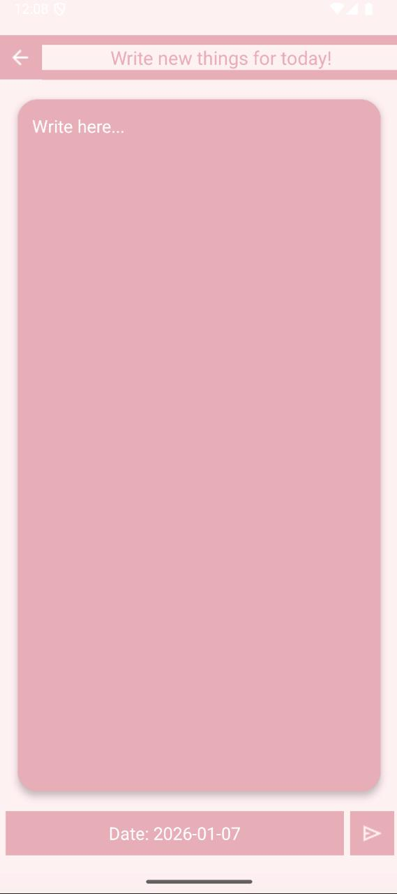
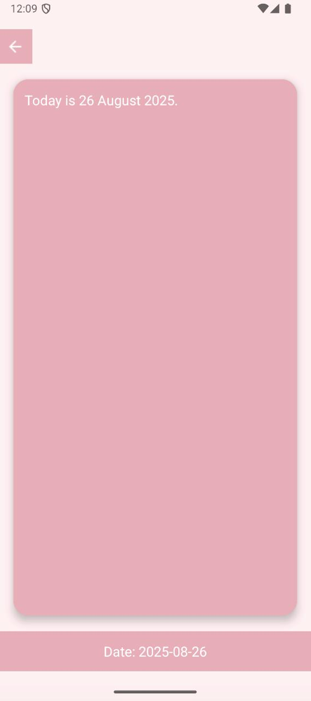

# MyDiaryApp
This is a simple diary application developed for personal use. It allows users to document their daily thoughts, save them for later reading, and manage entries efficiently.

I created this project to understand the fundamentals of Android Studio and mobile application development logic.

## Features
* **Add New Entries:** Select a date and write your thoughts.
* **Storage:** The app saves your writings locally so you can read them later.
* **Manage:** Delete old or unwanted entries easily.
* **Simple Interface:** User-friendly and minimalist design.

## Technologies Used
* **IDE:** Android Studio
* **Language:** Java 
* **UI:** XML Layouts
* **Storage:** SQLite (Custom DataBaseHelper class)

## Screenshots

  
  
  
  

## Getting Started
1.  Clone the repository.
2.  Open in Android Studio.
3.  Build and Run on an Emulator or Physical Device.

---
*Developed by Feyza Zeynep Bilgin.*
